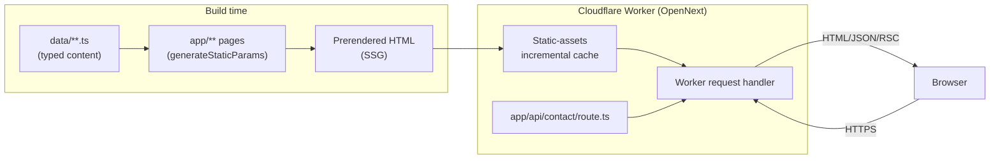

# Architecture

High-level overview of how O Level Islamiyat is built, structured, and deployed. For day-to-day
commands see [Developer-Guide.md](./Developer-Guide.md); for content authoring see
[Content-Architecture.md](./Content-Architecture.md); for why specific technical choices were
made see [Decision-Log.md](./Decision-Log.md).

## High-level architecture



The site is **content-first and almost entirely static**: nearly every route is prerendered at
build time from typed TypeScript data files (no CMS, no database). The one dynamic piece is the
`/api/contact` route, which handles form submissions server-side.

## Stack

| Layer | Technology |
|---|---|
| Framework | Next.js 15 (App Router), React 19, TypeScript (`strict: true`) |
| Styling | Tailwind CSS 3 |
| Icons | lucide-react |
| Deployment target | Cloudflare Workers, via `@opennextjs/cloudflare` |
| Testing | Vitest (unit/integration), Playwright (e2e) |
| CI | GitHub Actions |

## Folder structure

```
app/                  Next.js App Router — routes, layouts, metadata, API route
components/           Shared React components (PascalCase, named exports)
  illustrations/      Decorative inline-SVG components
data/                 All site content, as typed TypeScript literal arrays
  questions/          Past-paper question bank, split one file per exam year
  topics/             Lesson/topic content, split one file per syllabus section group
lib/                  Small framework-agnostic utilities (search, SEO helpers, etc.)
styles/               Global CSS (Tailwind entrypoint)
public/               (currently unused — no static /public assets committed)
source/               Original syllabus/past-paper source documents (.docx) — see below
docs/                 This documentation
  archive/            Historical build-log/audit documents, kept for project history
scripts/              One-off codegen script (gen-stub-pages.mjs)
tests/                Vitest unit + integration tests
e2e/                  Playwright end-to-end tests
.github/workflows/    CI pipeline
```

### Why `data/` and not a CMS

The site currently has ~450 content items (99 lessons + 351 past-paper questions + quizzes +
references + model answers). At this scale, typed TypeScript arrays checked by `tsc --noEmit` are
simpler, faster, and more reliable than standing up a CMS or database — every content item is
type-checked, and content changes are ordinary code reviews. See
[Content-Architecture.md](./Content-Architecture.md) for the full data layout and
[Decision-Log.md](./Decision-Log.md) for the reasoning behind splitting the largest data files by
year/section instead of keeping monolithic files.

## Routing

Standard Next.js App Router file-based routing under `app/`. Key dynamic segments:

- `/paper-1/[section]/[topic]`, `/paper-2/[section]/[topic]` — lesson pages, statically generated
  from `data/topics` via `generateStaticParams`.
- `/past-papers/question/[id]` — one page per past-paper question, from `data/questions`.
- `/past-papers/topical/[section]/[subtopic]`, `/past-papers/year-wise/[year]` — question index
  views.
- `/model-answers/[id]` — worked answers, from `data/model-answers.ts`.
- `/quotes-references/[category]/[id]`, `/quotes-references/topic/[section]/[subtopic]` —
  reference entries, from `data/references.ts`.
- `/quizzes/[id]` — quiz pages, from `data/quizzes.ts`.
- `/api/contact` — the one server-rendered API route (POST only).

Every dynamic segment enumerates its full param set at build time via `generateStaticParams`, so
almost the entire site is static HTML served from Cloudflare's edge cache.

## Data architecture

See [Content-Architecture.md](./Content-Architecture.md) for the authoring-facing view. In brief:

- `data/questions/` — one file per exam year (`2021.ts`…`2025.ts`) plus `types.ts` and an
  `index.ts` barrel that concatenates them and re-exports the original helper functions
  (`getQuestionsByYear`, `getQuestionById`, etc.) — so every importer still does
  `import { pastPaperQuestions } from "@/data/questions"` unchanged.
- `data/topics/` — one file per syllabus section group (e.g. `paper1-life-of-prophet.ts`), plus
  `types.ts` and an `index.ts` barrel (`allTopics`).
- `data/syllabus.ts` — the official syllabus structure (sections + subtopics) that every lesson
  and question links back to via `sectionSlug`/`subtopicSlug`.
- `data/search-index.ts` + `data/search-synonyms.ts` — a dependency-free search index built at
  module-load time from the other data arrays (see `lib/search.ts`).

A test (`tests/unit/topics-and-syllabus.test.ts`) locks in the invariant the project relies on:
**every syllabus subtopic has exactly one matching lesson, and every lesson maps back to a real
subtopic** — so this can't silently drift as content is added.

## SEO architecture

- **Metadata**: every route exports (or generates) a `Metadata` object; `lib/seo.ts` provides
  `canonical()` for absolute canonical URLs sourced from `siteConfig.domain`.
- **Structured data (JSON-LD)**: centralized via `components/JsonLd.tsx` (a thin `<script
  type="application/ld+json">` wrapper) and two generators in `lib/seo.ts` —
  `faqSchema()` and `articleSchema()` — used across every page that emits an `FAQPage` or
  `Article` schema, plus a site-wide `EducationalOrganization` schema in `app/layout.tsx` and
  `BreadcrumbList` schema in `components/Breadcrumbs.tsx`.
- **Sitemap/robots**: `app/sitemap.ts` and `app/robots.ts` are generated dynamically from the same
  data arrays that drive the pages, so they can't drift out of sync with real routes.
- **OG/Twitter images, icons**: generated via `next/og` (`app/opengraph-image.tsx`,
  `app/twitter-image.tsx`, `app/icon.tsx`, `app/apple-icon.tsx`).

## Testing architecture

See [Testing.md](./Testing.md) for the full guide. Summary:

- **Vitest** (`tests/unit/`, `tests/integration/`) — pure-function unit tests for `lib/` utilities
  and data-integrity checks on `data/`, plus one React Testing Library integration test for
  `Quiz.tsx`.
- **Playwright** (`e2e/`) — end-to-end browser tests against a real production build
  (`next build && next start`), covering navigation, search, the full quiz flow, topic pages, the
  contact form, and sitemap/robots.
- **CI**: both suites run on every push/PR (see below).

## CI/CD

`.github/workflows/ci.yml` runs two jobs on every push to `main` and every pull request:

1. **`verify`** — `npm run lint`, `npm run typecheck`, `npm run test` (Vitest), `npm run build`.
2. **`e2e`** (depends on `verify`) — installs Chromium, runs `npm run test:e2e` against a
   production build, uploads the Playwright HTML report as a build artifact.

There is currently no automated deploy step in CI — deployment is a manual step (see
[Deployment.md](./Deployment.md)), and at present changes are committed locally by an AI
assistant and pushed by the site owner as a separate step outside this repository's normal
`git push` flow.

## Build pipeline

Two distinct builds exist and both should pass before shipping:

```bash
npm run build         # standard Next.js build — fast sanity check
npm run pages:build   # Cloudflare-specific build via @opennextjs/cloudflare
```

`npm run pages:build` produces `.open-next/` (gitignored) — the actual Worker bundle
(`.open-next/worker.js`) and static assets (`.open-next/assets/`) that get deployed.

## Deployment

Deployed as a Cloudflare Worker via `@opennextjs/cloudflare`, not a static export — see
[Deployment.md](./Deployment.md) for the full walkthrough and
[Decision-Log.md](./Decision-Log.md) for why (the `/api/contact` route and `next/og` image
generation both require a real server runtime, not static hosting).

## Search system

`lib/search.ts` is a dependency-free, client-side search: `data/search-index.ts` builds a flat
array of `{ title, description, url, category, keywords }` entries from every other content data
source at module-load time (so it can never fall out of sync), and `data/search-synonyms.ts`
expands query terms (e.g. "makka" ↔ "makkah" ↔ "mecca") before scoring. Results are ranked by
where the match occurred (title > description > keywords) and every query token must match
*something* on an entry for it to qualify (AND semantics across words). Exposed via the header's
Ctrl/Cmd+K modal (`components/SearchModal.tsx`) and the `/search` page.

## Content system

See [Content-Architecture.md](./Content-Architecture.md).
